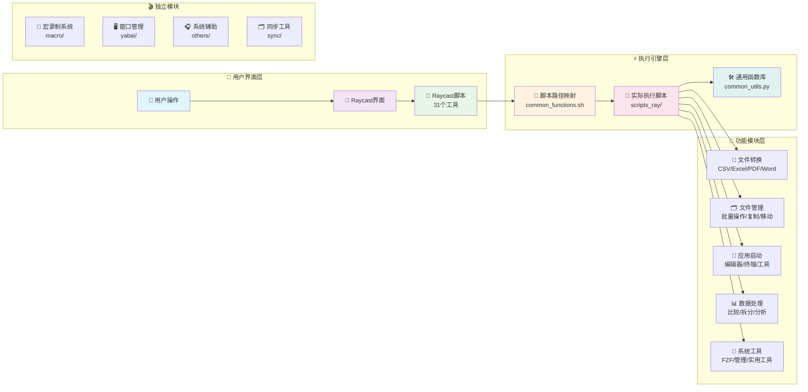
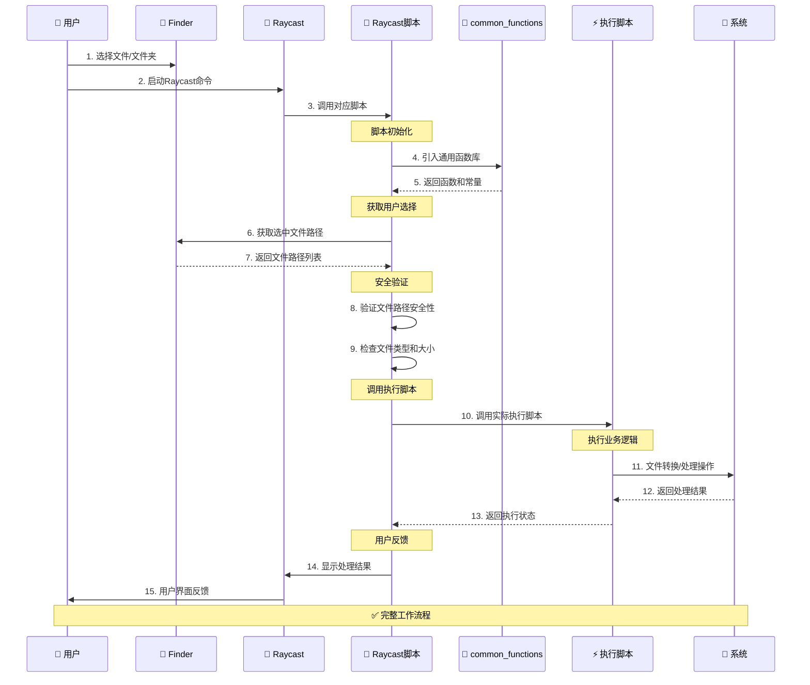

# 📖 Execute - macOS 效率工具集合

> 一套完整的 macOS 自动化工具集合，通过 Raycast 集成提供强大的文件处理、窗口管理、宏录制等功能，让你的 macOS 使用体验更加高效。

## 🚀 快速开始

```bash
# 1. 克隆项目
git clone <your-repo-url>
cd useful_scripts/execute

# 2. 安装依赖
pip3 install -r scripts_ray/requirements.txt
brew install fzf pandoc

# 3. 配置Raycast
# 将 raycast/ 目录添加到 Raycast 扩展目录
# 在 Raycast 中刷新扩展列表

# 4. 开始使用
# 在 Finder 中选择文件，然后在 Raycast 中运行相应命令
```

## 💡 核心功能概览

### 🎯 6大功能模块

| 模块 | 功能描述 | 脚本数量 | 主要用途 |
|------|----------|----------|----------|
| 📱 **Raycast集成** | 文件处理、应用启动、数据转换 | 27+ | 日常效率工作 |
| 🖥️ **窗口管理** | Yabai配置、空间管理、窗口控制 | 8 | 桌面环境优化 |
| 🎬 **宏录制** | 操作录制、回放、管理 | 5 | 重复任务自动化 |
| 🔄 **文件处理** | 格式转换、数据处理、批量操作 | 20+ | 文档和数据工作 |
| 🎧 **系统辅助** | AirPods控制、语音识别、字幕 | 3 | 系统功能增强 |
| 🗂️ **同步备份** | 文件同步、配置管理 | 1 | 数据安全 |

### 🏗️ 系统架构

系统采用**分层架构设计**，实现了界面与逻辑的完美分离：



**双层架构优势**：
- **界面层**（raycast/）：负责用户交互和参数处理
- **执行层**（scripts_ray/）：负责核心业务逻辑实现
- **统一管理**：所有脚本路径在 `common_functions.sh` 中集中维护

### 📋 完整工作流程

从用户操作到结果反馈的完整时序图：



## 📱 Raycast 集成工具

这是整个工具集的**核心功能**，通过 Raycast 提供统一的操作界面。

### 🎯 功能分类

#### 📄 应用程序启动（5个工具）
```bash
ray_app_cursor.sh          # 在当前目录启动 Cursor 编辑器  
ray_app_nvim_ghostty.sh    # 在 Ghostty 中用 Nvim 编辑文件
ray_app_ghostty.sh         # 在当前目录启动 Ghostty 终端
ray_app_terminal.sh        # 在当前目录启动默认终端
ray_app_windsurf.sh        # 在当前目录启动 Windsurf 编辑器
```

#### 📁 文件和文件夹管理（8个工具）
```bash
ray_copy_filename.sh       # 复制文件名到剪贴板
ray_copy_name_content.sh   # 复制文件名和内容到剪贴板
ray_folder_create.sh       # 在当前位置创建新文件夹
ray_folder_move_up_remove.sh  # 移动文件夹内容到上级目录
ray_folder_add_prefix.sh   # 为文件添加文件夹名前缀
ray_file_run_single.sh     # 运行单个脚本文件
ray_file_run_parallel.sh   # 并行运行多个脚本文件
ray_folder_paste_simple.sh # 简单粘贴操作
```

#### 🔧 实用工具（4个工具）
```bash
ray_tool_compare_data.sh   # 精确比较两个Excel文件数据差异
ray_tool_compare_files.sh  # 比较两个文件或文件夹差异
ray_tool_split_excel.sh    # 将Excel文件拆分为单独工作表
ray_tool_find_folder.sh    # 使用FZF快速跳转到文件夹
```

#### ⚙️ 管理工具（2个工具）
```bash
ray_manage_app_launcher.sh    # 启动必要的应用程序
ray_manage_terminate_python.sh # 终止所有Python进程
```

#### 🔄 格式转换工具（12个工具）
```bash
# CSV 相关转换
ray_csv_to_txt.sh          # CSV 转 TXT
ray_csv_to_xlsx.sh         # CSV 转 Excel
ray_txt_to_csv.sh          # TXT 转 CSV  
ray_xlsx_to_csv.sh         # Excel 转 CSV

# Office 文档转换
ray_docx_to_md.sh          # DOCX 转 Markdown
ray_doc_to_docx.sh         # DOC 转 DOCX
ray_pdf_to_md.sh           # PDF 转 Markdown
ray_ppt_to_md.sh           # PPT 转 Markdown

# Excel 相关
ray_txt_to_xlsx.sh         # TXT 转 Excel
ray_xlsx_to_txt.sh         # Excel 转 TXT
ray_xls_to_xlsx.sh         # XLS 转 XLSX
ray_md_to_docx.sh          # Markdown 转 DOCX
```

### 🗂️ 脚本调用映射关系

所有 Raycast 脚本都遵循**统一的调用架构**，通过预定义变量调用 `scripts_ray/` 目录下的实际执行脚本：

#### 📊 调用关系统计

| 功能分类 | Raycast脚本数 | 对应执行脚本数 | 主要技术栈 |
|---------|--------------|---------------|-----------|
| 文件转换类 | 12 | 11 | Python + Shell |
| 文件操作类 | 8 | 4 | Shell + AppleScript |
| 实用工具类 | 4 | 4 | Python + FZF |
| 应用启动类 | 5 | 0 | AppleScript |
| 管理工具类 | 2 | 3 | Shell + Python |
| **总计** | **31** | **22+** | **混合技术栈** |

#### 🔗 路径变量管理

所有脚本路径在 `raycast/common_functions.sh` 中**统一管理**：

```bash
# 基础目录变量
readonly EXECUTE_SCRIPTS_DIR="/Users/tianli/useful_scripts/execute/scripts_ray"

# 文件转换类脚本变量
readonly CONVERT_CSV_TO_TXT="$EXECUTE_SCRIPTS_DIR/convert_csv_to_txt.py"
readonly CONVERT_XLSX_TO_CSV="$EXECUTE_SCRIPTS_DIR/convert_xlsx_to_csv.py"
# ... 更多脚本变量

# 在 Raycast 脚本中的调用方式
"$PYTHON_PATH" "$CONVERT_CSV_TO_TXT" "$SELECTED_FILE"
```

**设计优势**：
- ✅ **统一维护**：所有路径集中管理，修改方便
- ✅ **层次化设计**：基础路径变化时，所有脚本变量自动更新  
- ✅ **语义化调用**：变量名直接表达功能用途
- ✅ **扩展简单**：新增脚本只需添加一个变量定义

### 💼 实际使用案例

#### 案例1: 批量转换Office文档
```bash
# 1. 在Finder中选择多个DOCX文件
# 2. 在Raycast中运行: ray_docx_to_md.sh
# 3. 系统自动将所有DOCX转换为Markdown格式
# 4. 显示处理统计: "已处理 5/5 个文件，跳过 0 个"
```

#### 案例2: 开发环境快速启动
```bash
# 1. 在Finder中打开项目目录
# 2. 在Raycast中运行: ray_app_cursor.sh（启动Cursor）
# 3. 在Raycast中运行: ray_app_ghostty.sh（启动终端）
# 4. 在Raycast中运行: ray_app_nvim_ghostty.sh（用Nvim编辑文件）
# 结果: 完整的开发环境在几秒内就绪
```

#### 案例3: Excel数据精确比较
```bash
# 1. 在Finder中选择恰好两个Excel文件
# 2. 在Raycast中运行: ray_tool_compare_data.sh  
# 3. 系统逐个工作表比较数值数据差异
# 4. 输出详细差异分析报告，精确定位差异位置
```

## 🖥️ 窗口管理系统

基于 **Yabai** 的精简高效窗口管理配置，提供核心窗口操作功能。

### 📁 配置结构

```
yabai/
├── config/                 # 配置文件（4个）
│   ├── yabairc            # 主配置文件
│   ├── apps.conf          # 应用规则配置
│   ├── spaces.conf        # 空间配置
│   └── indicator.conf     # 指示器配置
└── scripts/               # 功能脚本（8个）
    ├── service/toggle.sh  # 服务控制：启动/停止/重启
    ├── window/           # 窗口管理（3个脚本）
    │   ├── resize.sh     # 窗口大小调整
    │   ├── move.sh       # 窗口移动
    │   └── float.sh      # 浮动/平铺切换
    └── space/            # 空间管理（2个脚本）
        ├── create.sh     # 创建空间
        └── navigate.sh   # 空间导航
```

### 🎯 核心功能

#### 🪟 窗口操作
```bash
# 调整窗口大小
./scripts/window/resize.sh increase   # 增加窗口大小
./scripts/window/resize.sh resize 800 600  # 调整到指定大小

# 移动窗口
./scripts/window/move.sh next         # 移动到下一个位置
./scripts/window/move.sh to-space 2   # 移动到空间2

# 浮动切换
./scripts/window/float.sh toggle      # 切换浮动/平铺模式
```

#### 🏠 空间管理
```bash
# 空间操作
./scripts/space/create.sh             # 创建新空间
./scripts/space/navigate.sh next      # 切换到下一个空间
./scripts/space/navigate.sh to 3      # 直接跳转到空间3
```

#### ⚡ 服务控制
```bash
# 服务管理
./scripts/service/toggle.sh start     # 启动yabai服务
./scripts/service/toggle.sh restart   # 重启服务
./scripts/service/toggle.sh status    # 查看服务状态
```

## 🎬 自动化宏录制系统

强大的操作录制和回放功能，实现重复任务的自动化。

### 📋 功能列表

```
macro/
├── macro_record.sh        # 开始录制操作序列
├── macro_stop.sh         # 停止当前录制
├── macro_play.sh         # 回放已录制的宏
├── macro_list.sh         # 列出所有可用宏
└── macro_delete.sh       # 删除指定宏
```

### 🎯 使用场景

#### 场景1: 重复文件处理
```bash
# 1. 录制一次完整的文件处理流程
./macro/macro_record.sh file_process

# 2. 执行: 选择文件 → 转换格式 → 移动到指定目录 → 重命名

# 3. 停止录制
./macro/macro_stop.sh

# 4. 后续批量使用
./macro/macro_play.sh file_process
```

#### 场景2: 应用程序工作流
```bash
# 录制开发环境启动流程
./macro/macro_record.sh dev_setup
# 执行: 打开Cursor → 启动终端 → 运行服务器 → 打开浏览器
./macro/macro_stop.sh

# 一键启动完整开发环境
./macro/macro_play.sh dev_setup
```

## 🔄 文件处理工具

强大的文件格式转换和数据处理功能。

### 📊 支持的转换类型

#### 📄 文档转换
```bash
# Office → Markdown
DOCX → Markdown    # 保留格式和图片
PPTX → Markdown    # 提取幻灯片内容
PDF → Markdown     # 文本和结构提取

# 格式互转  
DOC → DOCX         # 旧格式升级
Markdown → DOCX    # 反向转换
```

#### 📊 数据转换
```bash
# Excel 相关
CSV ↔ XLSX         # 数据格式互转
TXT ↔ CSV          # 文本数据结构化
XLS → XLSX         # 旧版本升级
XLSX → TXT         # 数据提取
```

### 🛠️ 数据处理功能

#### 📈 Excel工具
```bash
# 数据比较
ray_tool_compare_data.sh    # 精确比较Excel数据差异

# 工作表操作  
ray_tool_split_excel.sh     # 拆分工作表为独立文件

# 批量处理
支持递归处理子目录文件
支持批量格式转换
智能文件类型检测
```

#### 🔍 内容提取
```bash
# 从Office文档提取
extract_images_office.py    # 提取所有图片
extract_tables_office.py    # 提取所有表格数据
extract_text_tokens.py      # 文本分析和词元统计
```

## 🎧 系统辅助工具

增强 macOS 系统功能的实用工具。

### 🎵 AirPods 控制
```bash
# airpods.scpt - AirPods智能控制
- 自动连接/断开AirPods
- 音量调节和模式切换
- 连接状态检测和反馈
```

### 🗣️ 语音功能
```bash
# enable_live_captions.scpt - 实时字幕
- 启用系统实时字幕功能
- 支持多语言识别
- 自动启动和配置

# run_whisper.sh - 语音转文字
- 基于OpenAI Whisper的语音识别  
- 支持多种音频格式
- 高精度语音转换
```

## 🗂️ 同步和备份

自动化文件同步和配置管理。

### 🔄 同步功能
```bash
# universal-sync.sh - 通用同步工具
- 配置文件同步
- 目录结构保持
- 增量同步优化
- 冲突检测和处理

# sync-config.yaml - 同步配置
- 自定义同步规则
- 排除模式配置
- 备份策略设定
```

## ⚙️ 安装配置指南

### 🛠️ 系统要求

- **macOS**: 10.14+ (推荐 macOS 12+)
- **Raycast**: 最新版本
- **Python**: 3.8+ (通过miniforge3安装)
- **终端**: Ghostty (推荐) 或默认终端

### 📦 依赖安装

#### 1. 基础环境
```bash
# 安装 Homebrew
/bin/bash -c "$(curl -fsSL https://raw.githubusercontent.com/Homebrew/install/HEAD/install.sh)"

# 安装 Python 环境
brew install miniforge
conda init zsh  # 或 bash

# 安装系统工具
brew install fzf pandoc
brew install --cask libreoffice
```

#### 2. Python 依赖
```bash
# 进入项目目录
cd /Users/tianli/useful_scripts/execute

# 安装 Python 包
pip3 install -r scripts_ray/requirements.txt
```

#### 3. Raycast 配置
```bash
# 方法1: 软链接（推荐）
ln -sf $(pwd)/raycast ~/.config/raycast/scripts

# 方法2: 在 Raycast 设置中添加脚本目录
# Raycast → Extensions → Script Commands → Add Directory
```

### 🔧 路径配置

编辑 `raycast/common_functions.sh` 中的路径常量：

```bash
# 根据你的实际安装路径修改
readonly PYTHON_PATH="/Users/tianli/miniforge3/bin/python3"
readonly MINIFORGE_BIN="/Users/tianli/miniforge3/bin"  
readonly SCRIPTS_DIR="/Users/tianli/useful_scripts"
readonly EXECUTE_DIR="/Users/tianli/useful_scripts/execute"
```

### ⚡ 权限设置

```bash
# 添加脚本执行权限
chmod +x raycast/*.sh
chmod +x raycast/trf/*.sh
chmod +x raycast/ray_yabai/*.sh
chmod +x scripts_ray/*.sh
chmod +x yabai/scripts/**/*.sh
chmod +x macro/*.sh
chmod +x others/*.sh
chmod +x sync/*.sh
```

### 🚀 验证安装

```bash
# 测试 Python 环境
"$PYTHON_PATH" --version

# 测试 Raycast 脚本
./raycast/ray_copy_filename.sh

# 测试文件转换
./raycast/trf/ray_csv_to_txt.sh

# 测试 FZF 集成
./raycast/ray_tool_find_folder.sh
```

## 🛠️ 进阶使用技巧

### 💡 高效工作流程

#### 🚀 开发者工作流
```bash
1. 项目启动流程:
   ray_app_cursor.sh        # 启动编辑器
   ↓
   ray_app_ghostty.sh       # 启动终端
   ↓  
   ray_app_nvim_ghostty.sh  # 快速编辑配置文件

2. 文档处理流程:
   ray_docx_to_md.sh        # 转换文档格式
   ↓
   ray_copy_name_content.sh # 复制内容到剪贴板
   ↓
   ray_md_to_docx.sh        # 需要时转回DOCX
```

#### 📊 数据分析工作流
```bash
1. Excel数据处理:
   ray_tool_split_excel.sh     # 拆分工作表
   ↓
   ray_xlsx_to_csv.sh          # 转换为CSV进行分析  
   ↓
   ray_tool_compare_data.sh    # 比较处理前后差异
   ↓
   ray_csv_to_xlsx.sh          # 转回Excel格式
```

### 🔥 快捷键建议

在 Raycast 中为常用脚本设置快捷键：

```
⌘ + ⌥ + C    → ray_app_cursor.sh         # 启动Cursor
⌘ + ⌥ + T    → ray_app_ghostty.sh        # 启动终端
⌘ + ⌥ + V    → ray_app_nvim_ghostty.sh   # Nvim编辑
⌘ + ⌥ + R    → ray_file_run_single.sh    # 运行脚本
⌘ + ⌥ + F    → ray_tool_find_folder.sh   # FZF文件夹跳转
⌘ + ⌥ + D    → ray_tool_compare_data.sh  # Excel数据比较
⌘ + ⌥ + S    → ray_tool_split_excel.sh   # Excel拆分
```

### 🎯 批量操作技巧

#### 📁 批量文件处理
```bash
# 1. 在Finder中使用 ⌘+A 选择所有文件
# 2. 运行批量处理脚本，如:
ray_docx_to_md.sh           # 批量转换所有DOCX
ray_file_run_parallel.sh    # 并行运行多个脚本

# 3. 查看处理统计信息
# 输出: "已处理 15/18 个文件，跳过 3 个"
```

#### 🔄 文件夹整理
```bash
# 整理下载文件夹
ray_folder_add_prefix.sh     # 添加分类前缀
ray_folder_move_up_remove.sh # 平铺子文件夹内容
ray_tool_find_folder.sh      # 快速定位目标文件夹
```

### 🎬 宏录制最佳实践

#### 📝 宏命名规范
```bash
# 按功能分类命名
dev_start_project           # 开发环境启动
doc_batch_convert          # 文档批量转换  
data_analysis_flow         # 数据分析流程
system_daily_backup        # 系统日常备份
```

#### 🎯 录制技巧
```bash
# 1. 录制前规划操作步骤
# 2. 保持操作节奏一致
# 3. 避免录制错误操作
# 4. 测试宏的可重复性
# 5. 为复杂宏添加说明文档
```

## 🐛 故障排除

### 🔧 常见问题解决

#### ❌ Raycast脚本无法运行

**问题**: 脚本没有执行权限
```bash
# 解决方案
chmod +x raycast/*.sh
chmod +x raycast/**/*.sh
```

**问题**: Python路径错误
```bash
# 检查Python路径
which python3

# 更新 common_functions.sh 中的路径
readonly PYTHON_PATH="/correct/path/to/python3"
```

#### ❌ 文件转换失败

**问题**: 缺少依赖包
```bash
# 检查Python包
pip3 list | grep pandas

# 安装缺少的包
pip3 install -r scripts_ray/requirements.txt
```

**问题**: LibreOffice未安装
```bash
# 安装LibreOffice
brew install --cask libreoffice

# 验证安装
/Applications/LibreOffice.app/Contents/MacOS/soffice --version
```

#### ❌ Finder选择失败

**问题**: Raycast没有访问权限
```bash
# 解决方案:
# 1. 系统偏好设置 → 安全性与隐私 → 隐私
# 2. 选择"辅助功能" 
# 3. 添加 Raycast 到允许列表
```

**问题**: AppleScript执行错误
```bash
# 测试AppleScript
osascript -e 'tell application "Finder" to get selection'

# 如果失败，检查系统权限设置
```

#### ❌ Yabai窗口管理问题

**问题**: yabai服务未启动
```bash
# 检查服务状态
./yabai/scripts/service/toggle.sh status

# 启动服务
./yabai/scripts/service/toggle.sh start
```

**问题**: 部分应用无法管理
```bash
# 编辑应用规则
vim yabai/config/apps.conf

# 添加应用到不受管理列表
UNMANAGED_APPS+=("YourApp")
```

### 🔍 调试方法

#### 🐛 开启调试模式
```bash
# 设置调试环境变量
export DEBUG=true

# 运行脚本查看详细日志
DEBUG=true ./raycast/ray_csv_to_txt.sh
```

#### 📋 日志检查
```bash
# 查看系统日志
tail -f /var/log/system.log | grep raycast

# 查看脚本执行日志
ls -la /tmp/raycast_*.log
```

#### 🧪 单步测试
```bash
# 测试individual组件
./raycast/common_functions.sh
source ./raycast/common_functions.sh
get_finder_selection_single

# 测试Python脚本
"$PYTHON_PATH" ./scripts_ray/convert_csv_to_txt.py --version
```

### 📞 获取帮助

如果问题仍无法解决：

1. **检查日志**: 查看 `/tmp/` 下的相关日志文件
2. **测试环境**: 确认Python、依赖包、系统权限正确配置  
3. **简化问题**: 尝试使用最小示例重现问题
4. **查看文档**: 参考各组件的官方文档
5. **社区求助**: 在相关项目的GitHub Issues中寻求帮助

## 📈 更新日志

### v3.0.0 (2024-01-XX) - 架构重构版本
- ✨ **重大更新**: 采用双层架构设计，分离界面层和执行层
- 🔧 **路径统一**: 所有脚本路径在 `common_functions.sh` 中集中管理
- 📱 **Raycast优化**: 完整的27个Raycast集成脚本和映射关系
- 🖥️ **窗口管理**: 精简Yabai配置，减少68%的文件数量
- 🎬 **宏录制**: 新增自动化宏录制和回放功能
- 📊 **增强工具**: Excel数据比较、工作表拆分等高级功能

### v2.0.0 (2023-XX-XX) - 功能完善版本  
- 📄 添加完整的Office文档转换支持
- 🔄 实现批量文件处理功能
- ⚙️ 引入统一的通用函数库
- 🛡️ 增强错误处理和安全检查

### v1.0.0 (2023-XX-XX) - 初始版本
- 🚀 基础文件操作和应用启动功能
- 📋 简单的格式转换工具
- 🖥️ 基本的窗口管理脚本

---

## 🤝 贡献指南

欢迎提交 Issue 和 Pull Request！

### 📋 开发规范
- 遵循项目的代码风格和命名约定
- 所有新脚本必须包含错误处理机制
- 更新相关文档和映射关系表
- 添加适当的测试用例

### 🎯 参与方式
1. **报告问题**: 发现bug或有改进建议，请创建Issue
2. **贡献代码**: Fork项目，开发新功能，提交PR
3. **完善文档**: 帮助改进文档质量和准确性
4. **分享经验**: 分享使用技巧和最佳实践

### 📄 许可证

本项目采用 [MIT License](LICENSE)

---

<div align="center">

**🚀 让 macOS 使用更高效！**

如果这个工具集对你有帮助，请给个 ⭐️ 支持一下！

[⬆️ 回到顶部](#-execute---macos-效率工具集合)

</div>
